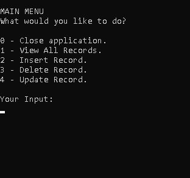
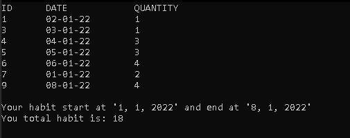

# Habit Tracking App

My first C# project. The application uses CRUD operation to track
a single habit. Developed using C# & Sqlite. Supported with MarkDown(VSCode) and Github.

# Requirements

- A Sqlite database and table are created if they do not already exist.
- Option to allow users to record daily habit, delete/update existing records and view all records.
- User can exit the application when they enter 0.  
- All possible error are accounted for with error messages.
- Validation check for input. For date the validation is "dd-mm-yy". For quantity
it must be numeric and larger than 0.
- The application also keep track of earliest and latest date and total amount of habit.

# Features
 

## SQLite 
- The program use SQLite connection to store and read data.
- If no database or table exist, they will be created when program start.

 

## Console-based UI in which user navigate by key press

# CRUD Function

- From the main menu user can Create, Read, Update or Delete entries with their
chosen date (dd-mm-yy). Duplicates will not be inputted.
- Inputted date will be validated and asked to re-enter if not in the correct format.

## Basic Report

# Challenges

- First time with CRUD operation and Sqlite. Need to learn them by watching some tutorials. Debugging commands with SQL takes a while because of its interaction with C#.
- Parsing various variables, especially DateTime, was a challenge. I need to learn how to convert into and from different datatype to store or to process them. 

# Lessons Learned

- Learned how to use CRUD operation and SQL. These are essential to learn as a developer since most real world applications use them.
- Create method for different purpose. Doing so allows me to debug easier and also organize my code better. 
- Used Visual Studio Code to document this README file with MarkDown.
